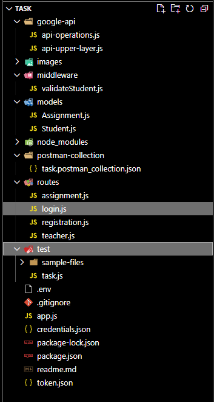
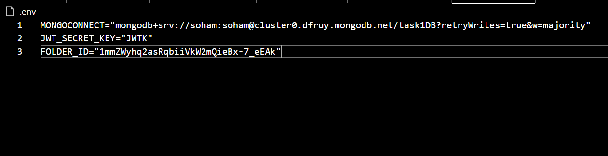
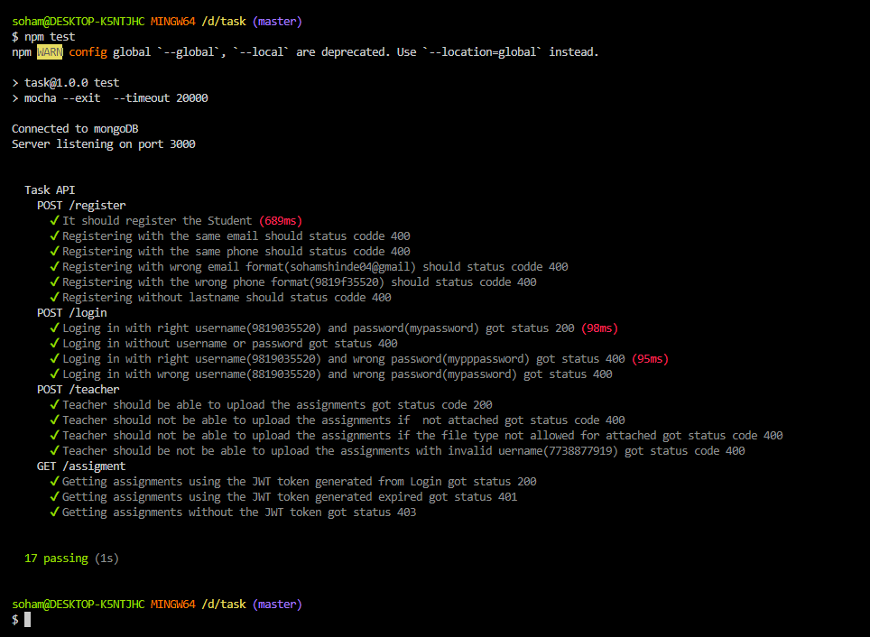
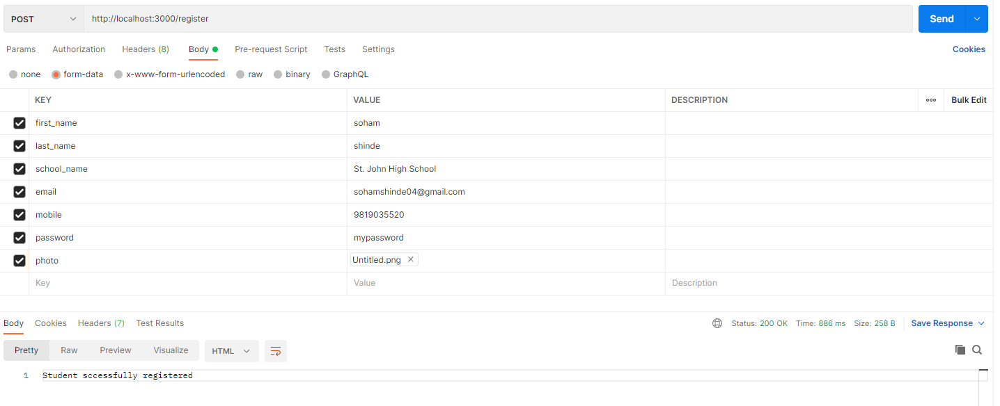
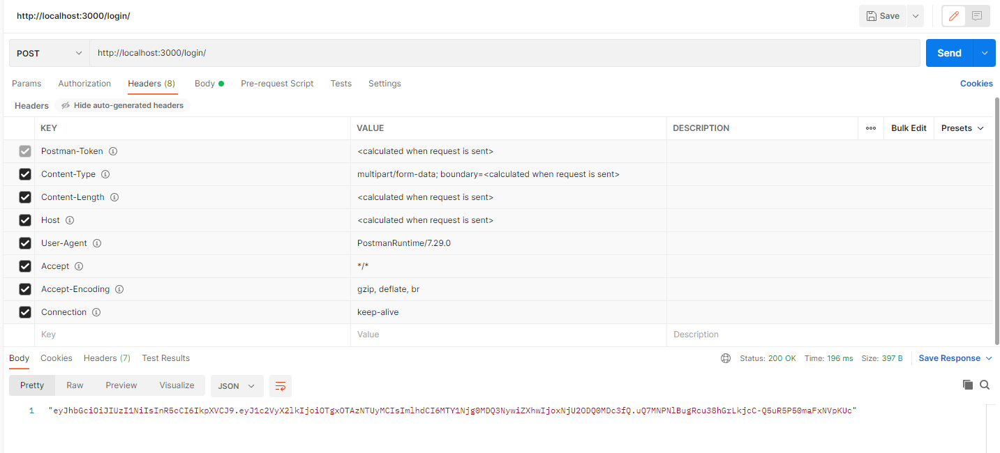
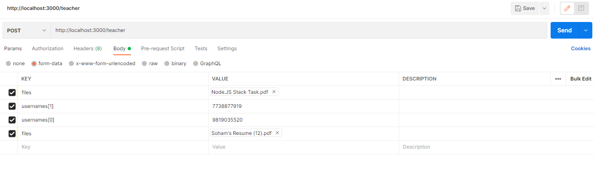
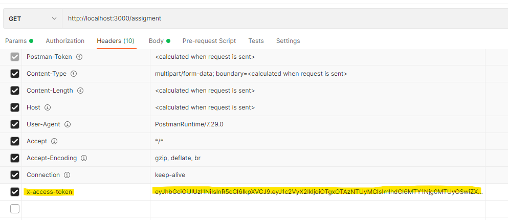
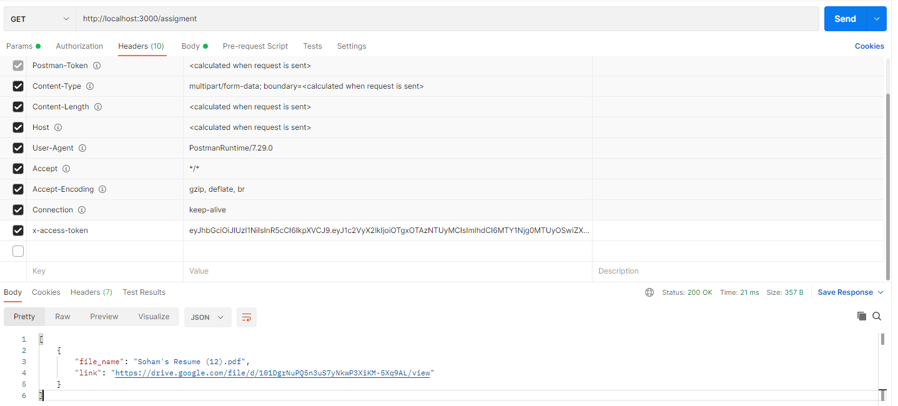

# Internship task

Task question : https://docs.google.com/document/d/1vPkPD9qegaK-30twe2kJduTQfJAfg38N2-OPpeAAX98/edit?usp=sharing

## The MVC pattern is followed 


The `models` folder contains the models of the Database

Since its an API it doesnt have a `view` part

The `app.js` along with `routes` and `middleware` constitute the controller part of the application

## Installation

`Node version used : v16.15.1`

Use the package manager [npm](https://www.npmjs.com/) to install the dependencies.

Use [Postman](https://www.postman.com/) to test the API.

The testing collectoin for postman can be found in the `postman-collection` folder

Use the following command to install the required packages
```bash
npm i
```

For running the project successfully we need to have some environmental variables sorted in the .env file
as shown below


```
1) MONGOCONNECT = Mongoose connection URL 
2) JWT_SECRET_KEY = JWT Token secret key
3) FOLDER_ID = Folder ID of the Google Drive folder in which the teacher would be uploading the file
```
I have provided the .env file in this case, but it should be hidden

After that we need to have 2 files `credentials.json` and `token.json` which we will get from Google Cloud.
In this project I have supplied both files of my Google Account in this case but it should be hidden

After all this we have to run the server, for that run the following command
```bash
npm start
```

## Unit teasting

For running the test one need to run the following command
```bash
npm test
```
The test file is hardcoded with test cases and no user with the same details must be present in the database before testing else the first test would go fail, because it would try to create the user again.

Below is the screenshot of the testing I had done



## API

We have the following API ending points

1) `POST` https://localhost:3000/register - For registering students we would `POST` the data in the given format in form data

 
    * Form Data valid | `STATUS CODE : 200`
    ```
    Student sccessfully registered
    ```
    * Form Data not valid | `STATUS CODE : 400`
    ```
    Message about the respective field
    ```
    * The given email already used by other user | `STATUS CODE : 400`
    ```
    Student with the given email already exists
    ```
    * The given mobile number already used by other user | `STATUS CODE : 400`
    ```
    Student with the given mobile already exists
    ```

2) `POST` https://localhost:3000/login - For logging in the users, we have to send the username and password in form. If we the username and password are authentic it will response with the JWT token which will be valid till `1 min `  else error status code of 400 with a message in JSON telling the reason 
`(Username or Password empty/Username not found/Wrong password)`. 


Possible formdata and their responses
* Valid username and password | `STATUS CODE : 200`
```
[JWT Token]
```
*  Username or Password field empty | `STATUS CODE : 400`
```
Username or Password empty
```
* Correct username but Wrong password | `STATUS CODE : 400`
```
Wrong password
```


3) `POST` https://localhost:3000/teacher - Teacher have to `POST` the assignments to this API endpoint for posting assignments to students. These would be accessible to the students at the other endpoint https://localhost:3000/assigment .



Possible formdata and their responses

* All the files and usernames are valid  `| STATUS CODE : 200`
```
Done uploading assignments
```
* Files not present | `STATUS CODE : 400`
```
Files not presents
```
* Invalid file Type | `STATUS CODE : 400`
```
Invalid file Type, allowed file types Images/PDF/Word File/ PPT
```
* Given student username is not present in the DB i.e. its not a registered student | `STATUS CODE : 400`
```
Invalid Username [Username]
```
* Any other Error | `STATUS CODE : 400`
```
Error uploading assignments
[Error Details]
```

4) `GET` https://localhost:3000/assigment - Students would have to send a GET request to this API endpoint to get the assignments assigned to them. They have to mention the JWT token they got from the login endpoint earlier and insert it in the `Header` in the `x-access-token` field as shown below


After sending GET request on the End point if the token is valid we would get a Json Array of object of following format as shown in the screenshot

If there is problem with the token we will get the following message


* Token is valid | `STATUS CODE : 200` 
```
    {
        "file_name": "example.pdf",
        "link": "example google drive file link"
    }
```
* Token is not present | `STATUS CODE : 403` 
```
Authentication token not found
```
* Invalid token present | `STATUS CODE : 401` 
```
Authentication token invalid
```

## Pakages used 
1) [express](https://expressjs.com/) : For making server
2) [formidable](https://www.npmjs.com/package/formidable) : For parsing the form fields and files
3) [joi](https://www.npmjs.com/package/joi) : For validating the form fields
4) [mongoose](https://www.npmjs.com/package/mongoose) : To interst with the MongoDB
5) [dotenv](https://www.npmjs.com/package/dotenv) : To take the variables from .env file to process variables
6) [bcryptjs](https://www.npmjs.com/package/bcryptjs) : For encrypting the paswrod before storing
7) [googleapis](https://www.npmjs.com/package/googleapis) : For uploading file(Assignment) to the google drive
8) [jsonwebtoken](https://www.npmjs.com/package/jsonwebtoken) : For generating and verifying the JWT tokens